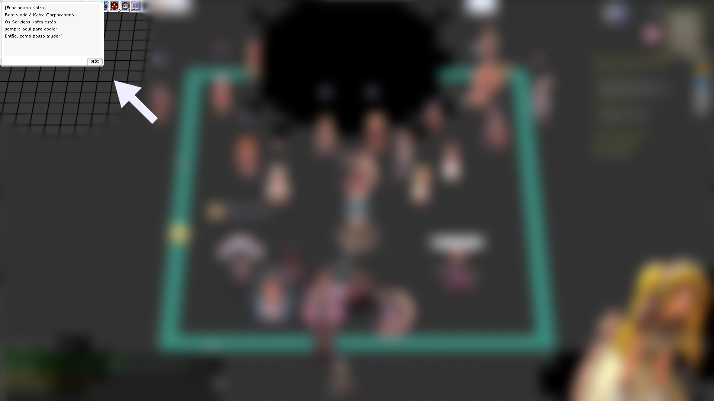

# Macrovisk ☭

## Download e instalação

- Python - [Download](https://www.python.org/downloads/)
- Tesseract - [Dowload](https://digi.bib.uni-mannheim.de/tesseract/tesseract-ocr-w64-setup-5.3.3.20231005.exe)

## Instalando Macrovisky

Na area de trabalho segure <kbd>Ctrl</kbd> clique com o botão direito e escolha "Abrir Janela dp PowerShell aqui"

Dentro do PowerShell crie uma pasta com o comando:

```mkdir macrovisky```

Entre na pasta:

```cd macrovisk```

#### Preparando o ambiente e clonando o repositorio:

Atualizando pip:
```pip3 install --upgrade pip```

Baixando Dependências:
```pip install -r requirements.txt```

Clonando Repositório
```git clone https://github.com/thiagopinotti/macrovisky.git```

## Executando:

```python -m main.py```

As teclas para uso da macro são:

<kbd>Home</kbd> - Inicia a macro
<kbd>PageUp</kbd> - Pausa a macro
<kbd>PageDown</kbd> - Termina a macro.

## Configurações

- Configurar Macro no 4Rtools para a tecla F2
- @buff no atalho <kbd>Alt</kbd>+<kbd>0</kbd>
- É preciso estar usando a grf de chão preto.
- ZoomOut no máximo.
- Tela cheia com resolução 1920x1080
- Janela de dialogo no canto superior esquerdo.



## Referências

https://github.com/UB-Mannheim/tesseract/wiki